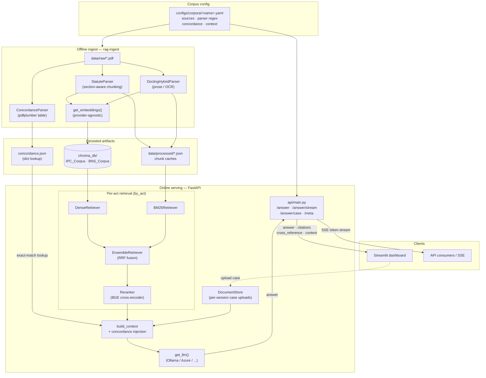

[](https://github.com/himmng/protoRAG/actions/workflows/ci.yml)

# protoRAG

A **corpus-agnostic**, production-bound hybrid RAG pipeline for legal corpora. The
reference corpus is Indian criminal law — the Indian Penal Code (IPC 1860) and the
Bharatiya Nyaya Sanhita (BNS 2023) with an authoritative IPC↔BNS concordance — but
nothing IPC/BNS-specific is hardcoded in the core. Swapping in a different corpus is
a matter of dropping a new corpus config + PDFs, setting `RAG_CORPUS`, and
re-ingesting — no code changes.

## What this project does

`protoRAG` combines lexical, dense, and reranked retrieval with LLM-driven answer
generation to support:

- multi-strategy retrieval over any configured corpus
- citation-aware answer generation, grounded in retrieved excerpts
- an optional **cross-reference** layer (e.g. IPC↔BNS concordance) surfaced as a
  separate, authoritative response field — config-gated per corpus
- an optional **legislative-context** layer (committee reports / statements of
  objects) retrieved as clearly-labeled, non-binding commentary
- **session-isolated case upload + Q&A**: upload a real case file and ask which
  sections apply, why, and how to interpret it — the upload is embedded into a
  private, per-session vector collection, never mixed into the main corpus
- streaming responses via Server-Sent Events (SSE)
- retrieval evaluation and threshold calibration
- a Streamlit dashboard driven entirely by the API's `/meta` endpoint

## Key features

- `fastapi` service exposing `/answer`, `/answer/stream`, `/answer/case`, `/meta`,
  document, and evaluation endpoints
- configurable retrievers: `bm25`, `dense`, `ensemble`, `hybrid_reranked`
- corpus selected at startup via `RAG_CORPUS`; collections, prompts, cross-reference
  labels, and PDF previews all derived from the corpus YAML
- reusable startup singleton pipeline for low latency
- vendor-agnostic model providers: Ollama, Azure OpenAI, AWS Bedrock, GCP Vertex AI,
  OpenAI (switch via `MODEL_PROVIDER`)
- auth guard with optional API-key mode; per-request rate limiting

## Architecture

The pipeline splits into an **offline ingest** path (run once per corpus change) and
an **online serving** path (the FastAPI request loop). Everything is driven from the
corpus YAML selected by `RAG_CORPUS`, so the core stays corpus-agnostic.



**Read the diagram as three lanes:** the corpus YAML (top) configures both paths;
ingest turns PDFs into Chroma vectors + chunk caches + a concordance dict; serving
retrieves per-act (dense + BM25 → RRF ensemble → BGE rerank), injects the
deterministic concordance lookup into context, and grounds the LLM answer. Case
uploads live in a separate per-session collection that never mixes into the corpus.

## Getting started

### Install locally

```bash
python -m venv .venv
source .venv/bin/activate
pip install --upgrade pip
pip install -e .            # add '.[dev]' for tests
```

### Ingest a corpus

Corpora live in `configs/corpora/<name>.yaml` (sources, parser regex, optional
concordance, optional context sources). Build the collections + chunk caches:

```bash
rag-ingest --corpus ipc_bns --clean          # full rebuild
rag-ingest --corpus ipc_bns --only IPC        # a single act
rag-ingest --corpus ipc_bns --only-context    # just the context layer
rag-ingest --corpus ipc_bns --dry-run         # parse + write JSON, no ChromaDB
```

Ingest runs offline and writes per-corpus chunk JSON to `data/processed/` and
vectors to `chroma_db/`.

### Generate Evalution set
The evaluation sets need .yaml mentioning the way the document corpus is designed need to store it at `./config/corpora/*document*.yaml`
```
source .venv/bin/activate
python -m rag_pipeline.eval.qgen_v2 --out eval/eval_set_v2.json      # resumes automatically if interrupted
python -m rag_pipeline.eval.qgen_v2 --out eval/eval_set_v2.json --fresh   # ignore checkpoint, start over
```
### Run the API

```bash
uvicorn rag_pipeline.api.main:app --host 0.0.0.0 --port 8000
```

Then open:

- `http://localhost:8000/docs` — interactive OpenAPI docs
- `http://localhost:8000/health` — readiness check
- `http://localhost:8000/meta` — active-corpus metadata

### Run the dashboard

```bash
streamlit run apps/dashboard/app.py           # talks to the API at :8000
```

### Run with Docker

```bash
docker compose up --build                     # API on :8000
```

## Configuration

Runtime configuration is via environment variables or a `.env` file.

Important variables:

- `RAG_CORPUS` — active corpus name (matches `configs/corpora/<name>.yaml`); default `ipc_bns`
- `API_KEYS` — comma-separated keys for API auth; empty disables auth (dev mode)
- `MODEL_PROVIDER` — one of `ollama`, `azure`, `openai`, `gcp`, `aws`
- `OLLAMA_HOST`, `OLLAMA_MODEL`, `OLLAMA_EMBEDDING_MODEL`
- `OPENAI_API_KEY`, `OPENAI_MODEL`, `OPENAI_EMBEDDING_MODEL`
- `AZURE_OPENAI_ENDPOINT`, `AZURE_OPENAI_API_KEY`, `AZURE_OPENAI_DEPLOYMENT`
- `AWS_REGION`, `AWS_BEDROCK_MODEL_ID`, `AWS_BEDROCK_EMBEDDING_MODEL_ID`
- `GCP_PROJECT_ID`, `GCP_REGION`, `GCP_VERTEX_MODEL`, `GCP_VERTEX_EMBEDDING_MODEL`
- `CHUNK_SIZE`, `CHUNK_OVERLAP`, `TOP_K`

### Example `.env`

```text
RAG_CORPUS=ipc_bns
MODEL_PROVIDER=ollama
OLLAMA_HOST=http://localhost:11434
OLLAMA_MODEL=gemma-4-e4b:latest
OLLAMA_EMBEDDING_MODEL=embeddinggemma:latest
API_KEYS=dev-key-123
LOG_LEVEL=INFO
```

## API overview

### Corpus metadata — `GET /meta`

Returns the active corpus name, display name, acts, PDF-previewable acts, whether the
context layer is enabled, and cross-reference labels. Clients (like the dashboard)
render entirely from this — no hardcoded act names.

### Health — `GET /health`

Service readiness and component status.

### Answer — `POST /answer`

```json
{
  "query": "What is the punishment for cheating?",
  "top_k": 5,
  "retriever": "hybrid_reranked",
  "collections": [],
  "include_context": false
}
```

`collections` is validated against the active corpus at runtime; empty = all acts.
The response includes `question`, `answer`, `citations`, an optional
`cross_reference` block (when the query names a section and the corpus has a
concordance), an optional `context` list (interpretive commentary, when
`include_context` is set), `retriever`, and `latency_ms`.

### Streaming — `POST /answer/stream`

Server-Sent Events: `cross_reference`, `citations`, `context`, incremental `token`
events, and a final `done` frame.

### Case Q&A — `POST /answer/case`

Interpret a previously uploaded case against the corpus. Requires an `X-Session-Id`
header and a `doc_id`. Retrieves the case's own isolated excerpts + relevant corpus
sections + cross-references, and explains which sections apply, why, and how.
Commentary is included by default here.

### Documents — `POST /documents/upload`, `GET /documents`, `DELETE /documents/{doc_id}`

Upload `pdf`, `txt`, or `md` case files. All document endpoints require an
`X-Session-Id` header; uploads are keyed by that token, embedded into a private,
per-session, TTL'd vector collection, and are never mixed into the main corpus or
visible across sessions.

### Page preview — `GET /documents/page-image`

Render one page of a corpus PDF (or the concordance table) to PNG for inline preview.
Valid `act` values come from the active corpus.

### Evaluation — `POST /eval/retrieval`, `POST /eval/threshold-sweep`

Run retrieval metrics and sweep confidence thresholds against the built-in eval set.

## Project layout

- `src/rag_pipeline/` — core package
  - `api/` — FastAPI app, routes, auth, logging, SSE, session-isolated doc store
  - `corpus/` — corpus registry (YAML → config) + concordance parser/lookup
  - `retrievers/` — retrieval implementations (`bm25`, `dense`, `ensemble`, `reranker`)
  - `parsers/` — statute (section-aware) and prose (Docling) parsers
  - `generation/` — answer generation and streaming logic
  - `eval/` — retrieval evaluation, threshold sweep, RAGAS support
  - `prompts/` — prompt templates shipped with the package
  - `cli/` — `rag-ingest` ingestion command
- `apps/dashboard/` — Streamlit dashboard
- `configs/corpora/` — corpus configuration YAMLs
- `data/` — raw and processed corpus artifacts
- `chroma_db/` — persisted Chroma collections
- `tests/` — pytest coverage for API, parsing, and evaluation

## Development notes

- The FastAPI app uses a startup lifespan handler to load heavy objects (reranker,
  retrievers, LLM) once and reuse them across requests.
- The default hybrid retriever is a two-stage semantic + reranked pipeline.
- The serving layer is corpus-agnostic; the concordance/cross-reference feature is
  optional and activated only when a corpus declares a `concordance:` block.

## Testing

```bash
pytest
```

## Contribution

This repository is in alpha. Please open issues for bug reports, feature requests, or
questions about the retrieval pipeline.
