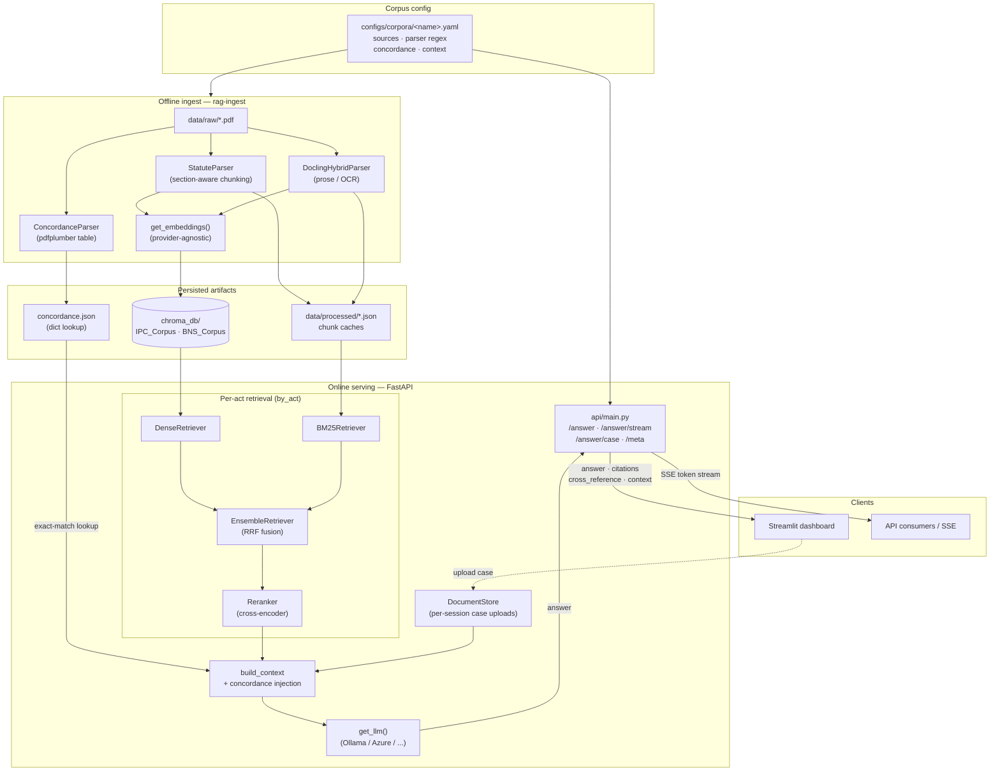

# protoRAG — Usage Guide

Full reference for configuring, running, and using every part of protoRAG. For a
5-minute quickstart, see the [top-level README](../README.md) (or [index](index.md)
if you're browsing this as a docs site).

This guide is prose documentation of *behavior and workflows*. It intentionally
does **not** re-list every request/response field — the API auto-generates that
from the code, and code always wins over hand-written docs that go stale:

- `http://localhost:8000/docs` — interactive Swagger UI, try requests live
- `http://localhost:8000/redoc` — ReDoc reference view of the same OpenAPI schema
- `http://localhost:8000/openapi.json` — the raw schema, for tooling/codegen

Treat this file as "how do I accomplish X and why does it work this way," and
`/docs` as "what exactly does this field accept."

## Contents

- [Architecture](#architecture)
- [Configuration](#configuration)
- [Corpus configuration](#corpus-configuration)
- [Ingesting a corpus](#ingesting-a-corpus)
- [Running the services](#running-the-services)
- [Using the API](#using-the-api)
- [Case-file Q&A](#case-file-qa)
- [Evaluation workflows](#evaluation-workflows)
- [Project layout](#project-layout)
- [Development notes](#development-notes)

## Architecture

The pipeline splits into an **offline ingest** path (run once per corpus change) and
an **online serving** path (the FastAPI request loop). Everything is driven from the
corpus YAML selected by `RAG_CORPUS`, so the core stays corpus-agnostic.



**Read the diagram as three lanes:** the corpus YAML (top) configures both paths;
ingest turns PDFs into Chroma vectors + chunk caches + a concordance dict; serving
retrieves per-act (dense + BM25 → RRF ensemble → cross-encoder rerank), injects the
deterministic concordance lookup into context, and grounds the LLM answer. Case
uploads live in a separate per-session collection that never mixes into the corpus.

## Configuration

Runtime configuration is via environment variables or a `.env` file at the project
root (loaded by `pydantic-settings` in `rag_pipeline/config.py`, and separately by
the Streamlit dashboard via `python-dotenv`). Copy `.env.example` to `.env` and
adjust.

### Core

| Variable | Default | Notes |
|---|---|---|
| `RAG_CORPUS` | `ipc_bns` | Active corpus; must match `configs/corpora/<name>.yaml` |
| `API_KEYS` | *(empty)* | Comma-separated valid keys; empty disables auth (dev mode) |
| `LOG_LEVEL` | `INFO` | Logger level for the `rag` logger |
| `CHUNK_SIZE` / `CHUNK_OVERLAP` | `800` / `120` | Prose chunking (Docling parser) |
| `TOP_K` | `5` | Default retrieval depth |
| `PREFERRED_ACT` / `ACT_TIE_DELTA` | *(empty)* / `0.05` | Tie-breaker when two acts score within delta |
| `RERANKER_MODEL` | `BAAI/bge-reranker-base` | HuggingFace cross-encoder, always local regardless of `LLM_PROVIDER` |

### Model providers

LLM and embeddings are configured **independently** — you can, for example, run
the LLM on Azure and embeddings on Ollama.

| Variable | Values |
|---|---|
| `LLM_PROVIDER` | `ollama` \| `azure` \| `openai` \| `gcp` \| `aws` |
| `EMBEDDING_PROVIDER` | `ollama` \| `azure` \| `openai` \| `gcp` \| `aws` |

Per-provider variables (only the ones matching your chosen provider(s) are
required):

- **Ollama**: `OLLAMA_HOST`, `OLLAMA_MODEL`, `OLLAMA_EMBEDDING_MODEL`
- **Azure OpenAI**: `AZURE_OPENAI_ENDPOINT`, `AZURE_OPENAI_API_KEY`,
  `AZURE_OPENAI_API_VERSION`, `AZURE_OPENAI_DEPLOYMENT`,
  `AZURE_OPENAI_EMBEDDING_DEPLOYMENT`
- **OpenAI**: `OPENAI_API_KEY`, `OPENAI_MODEL`, `OPENAI_EMBEDDING_MODEL`
- **AWS Bedrock**: `AWS_REGION`, `AWS_BEDROCK_MODEL_ID`, `AWS_BEDROCK_EMBEDDING_MODEL_ID`
- **GCP Vertex AI**: `GCP_PROJECT_ID`, `GCP_REGION`, `GCP_VERTEX_MODEL`,
  `GCP_VERTEX_EMBEDDING_MODEL`

Startup fails fast with a clear error if `LLM_PROVIDER=azure` and the required
Azure variables are missing (see `Config._validate_active_provider_config`).

The **active** resolved values are always inspectable at runtime via
`GET /meta` → `models` — this is also what the dashboard's sidebar renders, so it
never hardcodes a model name.

### Dashboard-only

| Variable | Default | Notes |
|---|---|---|
| `API_URL` | `http://localhost:8000` | Where the Streamlit app sends requests |
| `DASHBOARD_API_KEY` | *(empty)* | Should match one of the values in `API_KEYS` |

### Example `.env`

```text
RAG_CORPUS=ipc_bns
API_KEYS=dev-key-123

LLM_PROVIDER=ollama
EMBEDDING_PROVIDER=ollama
OLLAMA_HOST=http://localhost:11434
OLLAMA_MODEL=gemma-4-e4b:latest
OLLAMA_EMBEDDING_MODEL=embeddinggemma:latest

API_URL=http://localhost:8000
DASHBOARD_API_KEY=dev-key-123

LOG_LEVEL=INFO
```

## Corpus configuration

A corpus is a YAML file in `configs/corpora/<name>.yaml`. `RAG_CORPUS` selects it
at startup — nothing else in the serving code needs to change.

```yaml
name:         ipc_bns
display_name: Indian Criminal Law (IPC 1860 + BNS 2023)

# Each "source" produces one ChromaDB collection
sources:
  - act:              IPC
    pdf_path:         data/raw/IPC_1860.pdf
    collection:       IPC_Corpus
    chunks_output:    data/processed/ipc_chunks.json
    body_start_page:  14          # first page after the table of contents

# Optional — interpretive/legislative commentary, retrieved as labeled,
# non-authoritative context (never cited as law)
context_sources:
  - doc_type:      committee_report
    display_name:  BNS Standing Committee Report
    pdf_path:      data/raw/_deferred/BNS_standing_committee_report.pdf
    collection:    BNS_Context
    chunks_output: data/processed/context_committee_report.json

# Optional — a cross-reference/concordance table between two acts, parsed once
# and joined at query time (powers the `cross_reference` response field)
concordance:
  pdf_path:    data/raw/IPC_BNS_concordance.pdf
  output_json: data/processed/concordance.json

# Structural parser — how the statute is segmented into sections
parser:
  section_regex: '(?m)^\s*(\d+[A-Z]*)(?:\s*\((\d+[A-Za-z]?)\))?\s*\.\s+(?=[A-Z])'
  preserve_blocks:  [illustration, exception, explanation, proviso]
  max_chunk_chars:  1500

eval_set_path:  eval/eval_set_ipc_bns.json
negatives_path: eval/data/ipc_bns_negatives.yaml
```

**To add your own corpus:** drop your PDFs in `data/raw/`, write a new
`configs/corpora/<name>.yaml` following the shape above (a single `sources` entry
is enough to start — `concordance` and `context_sources` are optional), set
`RAG_CORPUS=<name>`, and run `rag-ingest --corpus <name> --clean`.

## Ingesting a corpus

Ingest is offline: it parses PDFs, writes chunk JSON to `data/processed/`, and
populates Chroma collections in `chroma_db/`.

```bash
rag-ingest --corpus ipc_bns --clean          # full rebuild
rag-ingest --corpus ipc_bns --only IPC       # a single act
rag-ingest --corpus ipc_bns --only-context   # just the legislative-context layer
rag-ingest --corpus ipc_bns --dry-run        # parse + write JSON, skip ChromaDB
```

Run this whenever you add a corpus, change a corpus's `parser` config, or replace a
source PDF. It does not need to run on every server restart — the API loads the
already-built collections at startup.

## Running the services

### API

```bash
uvicorn rag_pipeline.api.main:app --host 0.0.0.0 --port 8000
# dev reload:
uvicorn rag_pipeline.api.main:app --reload
```

Startup loads the reranker, per-act retrievers, and LLM client once into a
process-wide singleton (`_state`) — this is what makes per-request latency
reasonable; there's no per-request model reload.

### Dashboard

```bash
streamlit run apps/dashboard/app.py
```

Fully driven by `GET /meta` (corpus name, acts, cross-reference labels, active
model info) — it never hardcodes which corpus or model is running.

### Docker

```bash
docker compose up --build     # API on :8000
```

## Using the API

All endpoints are documented live at `/docs` (Swagger, with a "Try it out" button)
and `/redoc`. This section covers the workflows and *why*, not the field-by-field
schema.

### `GET /health`

Readiness probe — checks chunk loading, retriever availability, LLM client, and
Ollama reachability (if `LLM_PROVIDER=ollama` or `EMBEDDING_PROVIDER=ollama`).
Returns `healthy` / `degraded`.

### `GET /meta`

Everything a client needs to render without hardcoding corpus/model specifics:
active corpus name + display name, valid `acts` (for the `collections` filter),
which acts have previewable PDFs, whether the legislative-context layer is on,
cross-reference labels (if the corpus has a concordance), and the resolved
`models` block (LLM/embedding provider + model, reranker model, vector store).

### `POST /answer`

The core RAG call: retrieve → build context (+ concordance injection if a section
number is named) → generate → return a grounded, cited answer.

```bash
curl -s -X POST http://localhost:8000/answer \
  -H "X-API-Key: dev-key-123" -H "Content-Type: application/json" \
  -d '{
    "query": "What is the punishment for cheating?",
    "top_k": 5,
    "retriever": "hybrid_reranked",
    "collections": [],
    "include_context": false
  }' | python -m json.tool
```

- `retriever` — one of `hybrid_reranked` (default, best precision+recall),
  `dense` (vector-only), `bm25` (keyword-only, best for section numbers),
  `ensemble` (RRF fusion, no rerank — faster hybrid)
- `collections` — which acts to search; `[]` searches all acts in the active corpus
  (validated against `/meta`'s `acts` at request time)
- `include_context` — opt-in legislative commentary (committee reports / SOR) in
  the response's `context` field; off by default outside case Q&A

Response includes `answer`, `citations` (chunk-level, with score + section +
page), an optional `cross_reference` block (only populated when the query names a
section **and** the corpus declares a concordance), an optional `context` list, the
`retriever` actually used, and `latency_ms`.

### `POST /answer/stream`

Same request shape as `/answer`, but Server-Sent Events instead of one JSON blob —
useful for streaming tokens to a UI as they generate. Event order:
`cross_reference` (if any) → `citations` → `context` (if requested) → repeated
`token` events → terminal `done` (with `latency_ms`) or `error`.

```bash
curl -N -X POST http://localhost:8000/answer/stream \
  -H "X-API-Key: dev-key-123" -H "Content-Type: application/json" \
  -d '{"query": "Explain criminal conspiracy.", "top_k": 5}'
```

### Documents — case-file upload

See [Case-file Q&A](#case-file-qa) below.

### `GET /documents/page-image`

Renders one page of a corpus PDF (or the concordance table, `act=CONCORDANCE`) to
a PNG for inline preview. `act` must be one of `/meta`'s `pdf_acts`.

### `POST /eval/retrieval`, `POST /eval/threshold-sweep`

Covered in [Evaluation workflows](#evaluation-workflows).

## Case-file Q&A

Upload a real case file (judgment / FIR / charge sheet) and ask which statute
sections apply, why, and how to interpret it — the LLM reasons over the corpus
**and** the uploaded case together, but the upload itself is embedded into a
private, session-isolated vector collection. It is never mixed into the shared
corpus or visible to other sessions.

All document endpoints require an `X-Session-Id` header — this is the isolation
key. The dashboard generates one per browser session automatically; API consumers
should generate their own (e.g. a UUID) and keep sending the same one for a given
user/session.

```bash
SESSION="$(python -c 'import uuid; print(uuid.uuid4().hex)')"

# 1. upload
curl -s -X POST http://localhost:8000/documents/upload \
  -H "X-API-Key: dev-key-123" -H "X-Session-Id: $SESSION" \
  -F "file=@case.pdf" | python -m json.tool
# → {"doc_id": "...", "filename": "case.pdf", "char_count": ...}

# 2. ask about it
curl -s -X POST http://localhost:8000/answer/case \
  -H "X-API-Key: dev-key-123" -H "X-Session-Id: $SESSION" \
  -H "Content-Type: application/json" \
  -d '{"doc_id": "<doc_id from step 1>", "question": "Which sections apply here?", "top_k": 5}' \
  | python -m json.tool

# 3. list / delete
curl -s http://localhost:8000/documents -H "X-API-Key: dev-key-123" -H "X-Session-Id: $SESSION"
curl -s -X DELETE http://localhost:8000/documents/<doc_id> -H "X-API-Key: dev-key-123" -H "X-Session-Id: $SESSION"
```

`/answer/case` includes legislative commentary by default (`include_context=True`)
since interpretation is the whole point — pass `include_context: false` to
suppress it.

## Evaluation workflows

### Generate an eval set

Eval sets are LLM-generated Q&A pairs checked against the corpus, used to measure
retrieval quality. They need a corpus YAML (see
[Corpus configuration](#corpus-configuration)) already ingested.

```bash
python -m rag_pipeline.eval.qgen_v2 --out eval/eval_set_v2.json           # resumes automatically if interrupted
python -m rag_pipeline.eval.qgen_v2 --out eval/eval_set_v2.json --fresh   # ignore checkpoint, start over

python -m rag_pipeline.eval.qgen_v3 --out eval/eval_set_v3.json              # full set, verified, resumable
python -m rag_pipeline.eval.qgen_v3 --out eval/eval_set_v3.json --no-verify  # ~2x faster, no quality gate
```

Point `EVAL_SET_FILE` in `.env` at whichever file the server should load at
startup (used by `/eval/retrieval` and `/eval/threshold-sweep`).

### Run retrieval metrics

```bash
curl -s -X POST http://localhost:8000/eval/retrieval \
  -H "X-API-Key: dev-key-123" -H "Content-Type: application/json" \
  -d '{"retriever":"hybrid_reranked","top_k":5}' | python -m json.tool
```

Returns Hit@K, Recall@K, MRR, and snippet-match rate, both overall and sliced by
difficulty/category — useful for comparing retriever strategies or corpus changes.

### Sweep the confidence threshold

```bash
curl -s -X POST http://localhost:8000/eval/threshold-sweep \
  -H "X-API-Key: dev-key-123" -H "Content-Type: application/json" \
  -d '{"thresholds":[0.0,0.01,0.02,0.05,0.1,0.2],"top_k":5}' | python -m json.tool
```

Returns per-threshold precision/recall/F1 and the recommended threshold — this is
where `min_score` defaults (e.g. the dashboard's `0.01`) come from empirically.

### RAGAS (answer-quality) evaluation

Install the `eval` extra (`pip install -e ".[eval]"`) and see
`src/rag_pipeline/eval/` for the RAGAS A/B notebook-driven workflow. Results land
in `eval/results/ragas/`.

## Project layout

- `src/rag_pipeline/` — core package
  - `api/` — FastAPI app, routes, auth, logging, SSE, session-isolated doc store
  - `corpus/` — corpus registry (YAML → config) + concordance parser/lookup
  - `retrievers/` — retrieval implementations (`bm25`, `dense`, `ensemble`, `reranker`)
  - `parsers/` — statute (section-aware) and prose (Docling) parsers
  - `generation/` — answer generation and streaming logic
  - `eval/` — retrieval evaluation, threshold sweep, RAGAS support, eval-set generation
  - `prompts/` — prompt templates shipped with the package
  - `cli/` — `rag-ingest` ingestion command
- `apps/dashboard/` — Streamlit dashboard
- `configs/corpora/` — corpus configuration YAMLs
- `data/` — raw and processed corpus artifacts
- `chroma_db/` — persisted Chroma collections
- `tests/` — pytest coverage for API, parsing, and evaluation
- `notebooks/` — exploratory notebooks (quickstart, pipeline run, baseline dev)

## Development notes

- The FastAPI app uses a startup lifespan handler to load heavy objects (reranker,
  retrievers, LLM) once and reuse them across requests.
- The default hybrid retriever is a two-stage semantic + reranked pipeline.
- The serving layer is corpus-agnostic; the concordance/cross-reference feature is
  optional and activated only when a corpus declares a `concordance:` block.
- `docs/HANDOFF.md` and `docs/PROGRESS.md` are internal development logs (phase
  status, session-by-session changes) — not user-facing documentation.
