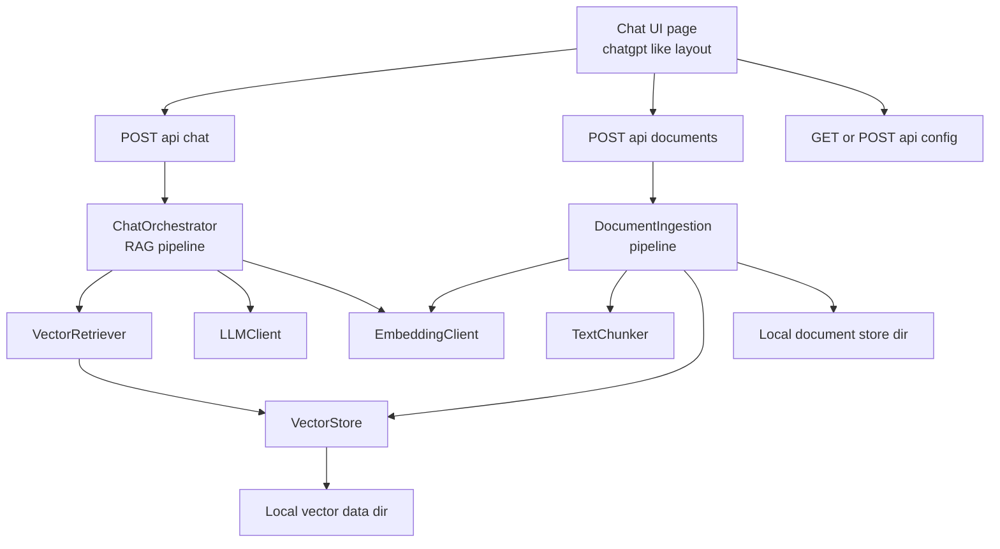
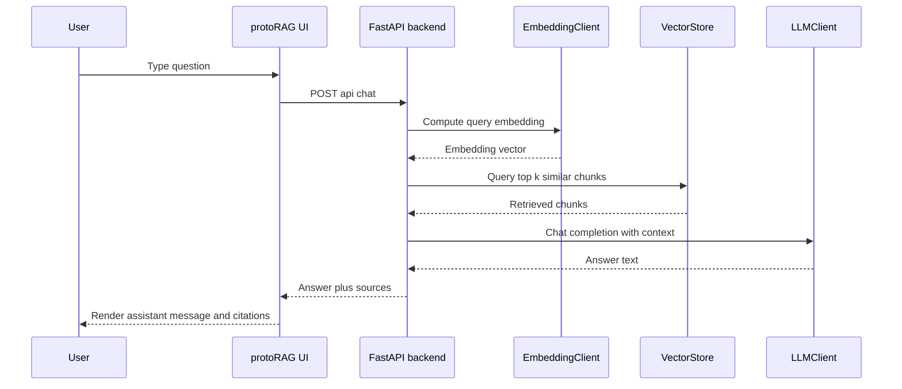

# protoRAG Architecture Plan

## 1. High-level Stack

- Backend: FastAPI [`backend/main.py`](backend/main.py:1)
- UI: Single-page app served by FastAPI using Jinja2 template + vanilla JS [`backend/templates/index.html`](backend/templates/index.html:1), [`backend/static/js/app.js`](backend/static/js/app.js:1), [`backend/static/css/styles.css`](backend/static/css/styles.css:1)
- Local LLM providers:
  - Ollama via OpenAI-compatible HTTP API
  - LM Studio via OpenAI-compatible HTTP API
- Embeddings:
  - Either Ollama or LM Studio embedding endpoints (user-configurable)
- Vector DB:
  - ChromaDB (local, file-backed) [`backend/core/vector_store.py`](backend/core/vector_store.py:1)
- Filestore:
  - Local filesystem directories for documents and vector data (user-configurable)
- Config:
  - YAML or JSON config file plus environment overrides [`backend/core/config.py`](backend/core/config.py:1)

## 2. Backend Architecture



### 2.1 Modules and Responsibilities

- `core/config.py` [`backend/core/config.py`](backend/core/config.py:1)
  - Load and validate configuration from `config.yaml` or `config.json`
  - Fields:
    - `llm.provider` (ollama or lmstudio)
    - `llm.base_url`
    - `llm.api_key` (optional, for LM Studio or other OpenAI-compatible servers)
    - `llm.model`
    - `embeddings.provider`
    - `embeddings.base_url`
    - `embeddings.api_key`
    - `embeddings.model`
    - `storage.vector_dir`
    - `storage.docs_dir`
  - Provide a singleton `AppConfig` object used across the app
  - Support runtime updates via API (persist back to file)

- `core/llm_client.py` [`backend/core/llm_client.py`](backend/core/llm_client.py:1)
  - Abstract interface `LLMClient`
  - Concrete implementations:
    - `OllamaLLMClient`
    - `LMStudioLLMClient`
  - Use OpenAI-compatible chat completions endpoint `/v1/chat/completions`
  - Select implementation based on config

- `core/embedding_client.py` [`backend/core/embedding_client.py`](backend/core/embedding_client.py:1)
  - Abstract interface `EmbeddingClient`
  - Concrete implementations:
    - `OllamaEmbeddingClient`
    - `LMStudioEmbeddingClient`
  - Use OpenAI-compatible embeddings endpoint `/v1/embeddings`

- `core/vector_store.py` [`backend/core/vector_store.py`](backend/core/vector_store.py:1)
  - Wrapper around ChromaDB
  - Responsibilities:
    - Initialize Chroma with `persist_directory` from config
    - Create or load a collection `protoRAG_docs`
    - Upsert embeddings with metadata (doc_id, chunk_id, file_name, path)
    - Query top-k results given an embedding

- `core/document_store.py` [`backend/core/document_store.py`](backend/core/document_store.py:1)
  - Manage physical documents in `storage.docs_dir`
  - Save uploaded files
  - Maintain simple index (e.g., JSON) mapping doc_id to file path and metadata

- `core/chunking.py` [`backend/core/chunking.py`](backend/core/chunking.py:1)
  - Implement text splitting (e.g., by paragraphs or fixed-size tokens)
  - Configurable chunk size and overlap

- `core/orchestrator.py` [`backend/core/orchestrator.py`](backend/core/orchestrator.py:1)
  - Implement RAG pipeline:
    - Given user query and chat history
    - Compute query embedding
    - Retrieve top-k chunks from vector store
    - Build prompt with system message, retrieved context, and conversation history
    - Call LLM client to generate response
    - Return response plus references to source documents

- `api/routes.py` [`backend/api/routes.py`](backend/api/routes.py:1)
  - FastAPI routers:
    - `POST /api/chat` for chat messages
    - `POST /api/documents` for document upload and indexing
    - `GET /api/config` to fetch current config
    - `POST /api/config` to update config
    - `GET /health` for health checks

- `main.py` [`backend/main.py`](backend/main.py:1)
  - FastAPI app initialization
  - Mount static files and templates
  - Include routers

## 3. Configuration System

### 3.1 Config File Structure

Example `config/config.yaml` [`config/config.yaml`](config/config.yaml:1):

```yaml
llm:
  provider: ollama  # or lmstudio
  base_url: http://localhost:11434
  api_key: null
  model: llama3

embeddings:
  provider: ollama  # or lmstudio
  base_url: http://localhost:11434
  api_key: null
  model: nomic-embed-text

storage:
  vector_dir: ./data/vector_store
  docs_dir: ./data/documents

rag:
  top_k: 5
  chunk_size: 512
  chunk_overlap: 64
```

### 3.2 Config API

- `GET /api/config`
  - Returns current config JSON
- `POST /api/config`
  - Accepts partial or full config JSON
  - Validates and persists to `config.yaml`
  - Reinitializes dependent components (LLM client, embedding client, vector store) as needed

## 4. UI Architecture (ChatGPT-like)

### 4.1 Layout

- Single page `index.html` [`backend/templates/index.html`](backend/templates/index.html:1)
  - Left sidebar:
    - App name `protoRAG`
    - New chat button
    - List of previous chats (optional for v1)
  - Main area:
    - Header with app name
    - Scrollable chat messages area
    - Each message styled like ChatGPT (user and assistant bubbles)
    - Input area at bottom with textarea and send button
  - Right side or modal:
    - Settings panel for configuring LLM, embeddings, and storage paths

### 4.2 Frontend Behavior

- `app.js` [`backend/static/js/app.js`](backend/static/js/app.js:1)
  - Handle sending messages:
    - Capture textarea input
    - Append user message to chat area
    - Call `POST /api/chat` with JSON body `{ message, conversation_id, history }`
    - Stream or poll for response (v1 can be non-streaming)
    - Append assistant response to chat area
  - Handle document upload:
    - File input + upload button
    - Call `POST /api/documents` with multipart form data
  - Handle config:
    - Load config on page load via `GET /api/config`
    - Populate settings form
    - On save, `POST /api/config`

### 4.3 Styling

- `styles.css` [`backend/static/css/styles.css`](backend/static/css/styles.css:1)
  - Match ChatGPT layout closely:
    - Dark theme
    - Centered chat column
    - Rounded message bubbles
    - Sticky input bar at bottom

## 5. RAG Workflow



## 6. Implementation Plan

1. Scaffold project structure
   - `backend/`
   - `backend/core/`
   - `backend/api/`
   - `backend/templates/`
   - `backend/static/js/`
   - `backend/static/css/`
   - `config/`
   - `data/`

2. Implement configuration system
   - `config/config.yaml` [`config/config.yaml`](config/config.yaml:1)
   - `backend/core/config.py` [`backend/core/config.py`](backend/core/config.py:1)

3. Implement LLM and embedding clients
   - `backend/core/llm_client.py` [`backend/core/llm_client.py`](backend/core/llm_client.py:1)
   - `backend/core/embedding_client.py` [`backend/core/embedding_client.py`](backend/core/embedding_client.py:1)

4. Implement vector store and document store
   - `backend/core/vector_store.py` [`backend/core/vector_store.py`](backend/core/vector_store.py:1)
   - `backend/core/document_store.py` [`backend/core/document_store.py:1`](backend/core/document_store.py:1)
   - `backend/core/chunking.py` [`backend/core/chunking.py`](backend/core/chunking.py:1)

5. Implement orchestrator
   - `backend/core/orchestrator.py` [`backend/core/orchestrator.py`](backend/core/orchestrator.py:1)

6. Implement FastAPI app and routes
   - `backend/api/routes.py` [`backend/api/routes.py`](backend/api/routes.py:1)
   - `backend/main.py` [`backend/main.py`](backend/main.py:1)

7. Implement UI
   - `backend/templates/index.html` [`backend/templates/index.html`](backend/templates/index.html:1)
   - `backend/static/js/app.js` [`backend/static/js/app.js`](backend/static/js/app.js:1)
   - `backend/static/css/styles.css` [`backend/static/css/styles.css`](backend/static/css/styles.css:1)

8. Add basic tests and docs
   - `README.md` [`README.md`](README.md:1)
   - Simple unit tests for config and orchestrator

9. Manual test with Ollama and LM Studio
   - Configure endpoints via UI
   - Upload sample documents
   - Ask questions and verify answers
